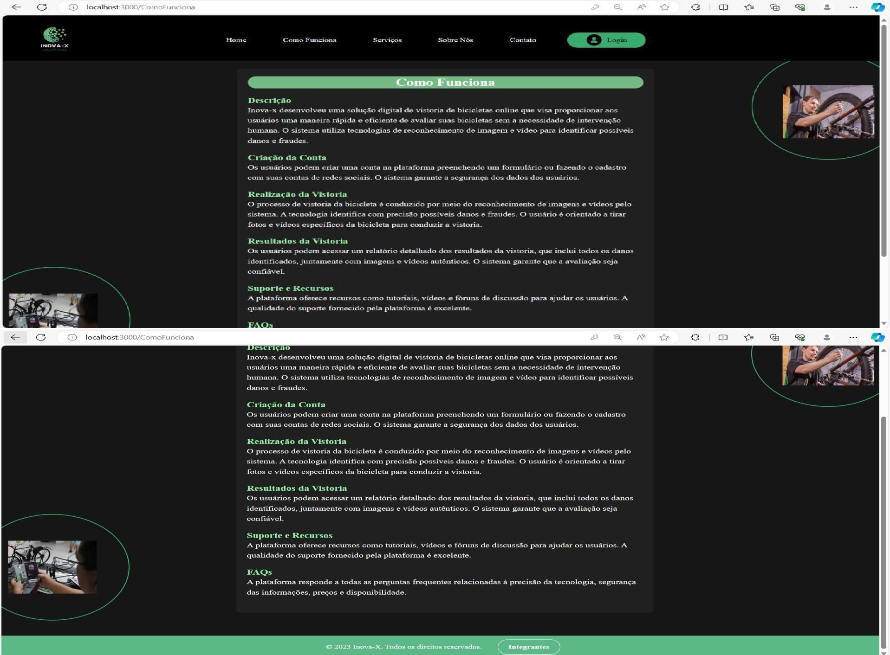
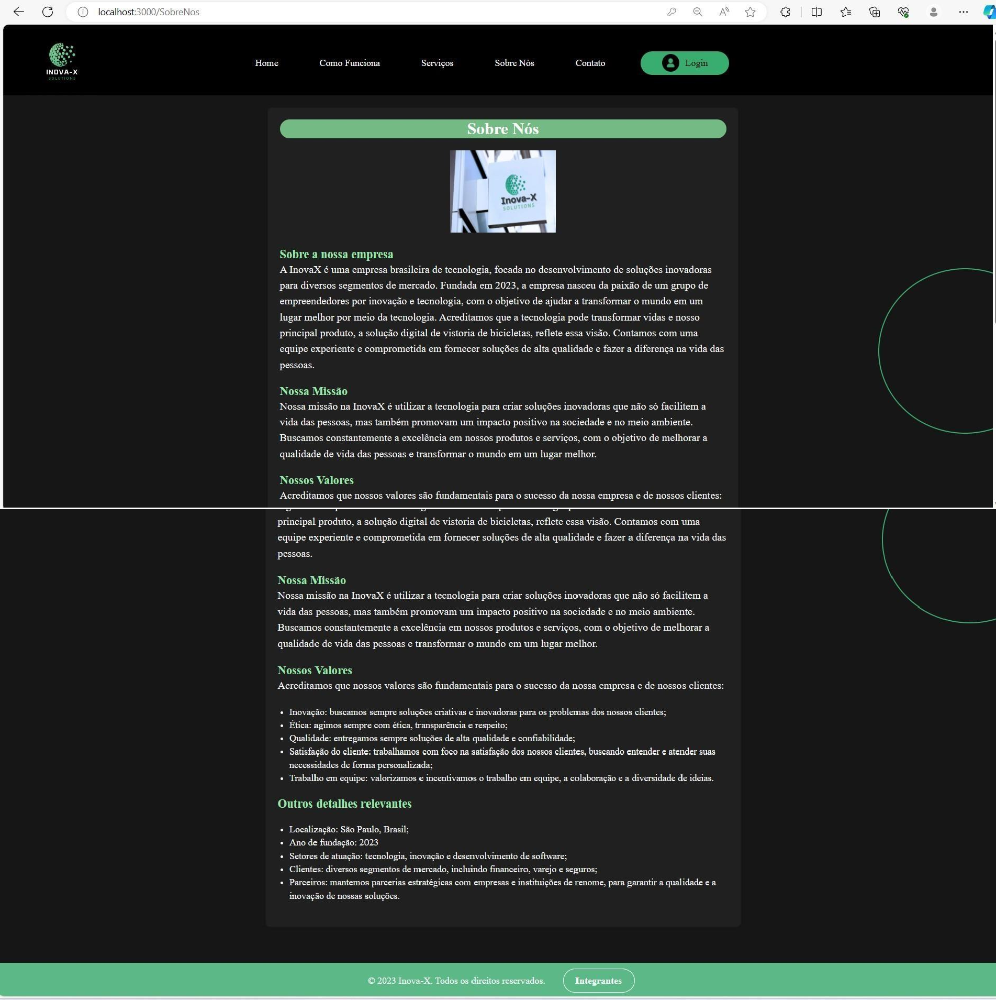

<h1>CHALLENG PORTO SEGURO - BANCO DE DADOS  :man_technologist: </h1>

<h2>Trabalho do derivado do Challenge – Porto Seguro, 
apresentado a FIAP, juntamente com a disciplina de 
Building Relational Database.</h2>

### Integrantes: 
- RM 550790 – Lucas dos Santos Lopes

- RM550718 – Murilo Machado (Responsável)

- RM 97900 – Victor Taborda

- RM 551823 - Gustavo Marques Catelan

- RM 552258 - Laís Alves da Silva Cruz

  <h1>Objetivo do Projeto :computer: </h1>

O projeto visa criar uma solução digital acessível para a Porto Seguro, que permita a avaliação de bicicletas dos clientes através de fotos ou vídeos em tempo real. Utilizando algoritmos de análise de imagem, o sistema automatizará e acelerará a inspeção de vistorias, identificando avarias, tipos e componentes da bicicleta, sinais de degradação, causas e consequências de danos. O objetivo é fornecer uma avaliação precisa e confiável, com recomendações de reparo. Serão armazenadas informações do cliente e da bicicleta, além de dados das vistorias realizadas, para monitorar e melhorar a qualidade do serviço.

  <h1>Imagens do Front End </h1>

Link do Repositório do Front End: https://github.com/laiscrz/inovax-next-js

